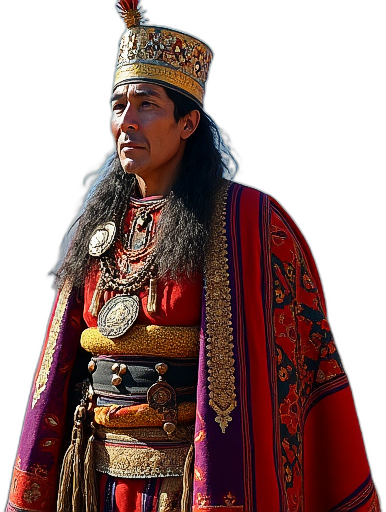

# Flux.1-dev (fp8) to generate 2d assets (stickers)

Generate 2d assets (stickers) based on a simple prompt.

### Input

- A prompt about an entity, e.g.

```
A proud Inca standing tall against a backdrop of majestic Andean mountains under a clear blue sky. He wears a royal tunic (uncu) made of fine, brightly colored wool, intricately woven with geometric patterns and adorned with gold and silver threads. On his head, he wears a gold mascaipacha, the Incan crown, a symbol of his noble status. His dark hair flows beneath the crown, and his stern face is weathered, reflecting the wisdom of a ruler. A vibrant, multicolored cloak (llaqtapu) drapes over his shoulders. He holds a quipu in one hand—a system of knotted cords used for record-keeping—and in the other, a wooden staff with a gold top, symbolizing his authority. The scene captures the strength, culture, and natural beauty of the Inca Empire at its peak, with the vibrant textiles and traditional symbols of power standing out vividly.
```

### Output




### Workflow

`workflow_flux.1-dev_img-to-2d-asset.json`: Workflow with Flux.1-dev nodes.

`workflow_flux.1-dev-falai_img-to-2d-asset.json`: Workflow with remote Flux.1-dev via FalAI nodes. A setup is required, check documentation of https://github.com/gokayfem/ComfyUI-fal-API .