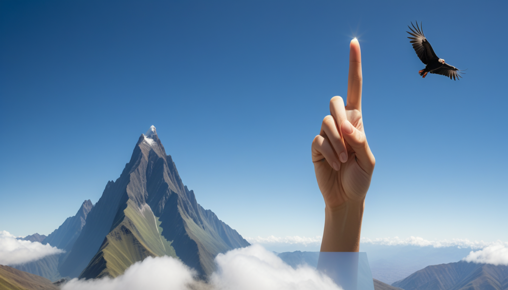

# SDXL with ControlNet Depth

From an depth map image to a photo-realistic image.

* Depth map image gotten using 'Depth anything' node (not used in the workflow).

### Input

- Depth map image


- Prompt

```
(1) A detailed image of a human hand with fingers extended to show the number 1. The hand has the index finger pointing upward, while the other fingers are closed into the palm. The skin tone is natural, and the lighting highlights the contours and details of the hand. The image focuses on the hand. The hand comes from a body which is not visible in the image.

(2) At the background, far away, there is a green mountain of the peruvian andes.

(3) A bit behind the hand, there is a condor flying through the blue sky.
```

- Negative prompts

```
text, watermark, deformation, abstract, unrealistic, out of frame, worst quality, low quality, jpeg artifacts, ugly, duplicate, morbid, mutilated, extra fingers, mutated hands, poorly drawn hands, poorly drawn face, mutation, deformed, blurry, dehydrated, bad anatomy, bad proportions, extra limbs, cloned face, disfigured, gross proportions, malformed limbs, missing arms, missing legs, extra arms, extra legs, fused fingers, too many fingers, long neck
```

### Output

Without refiner:



With refiner:


